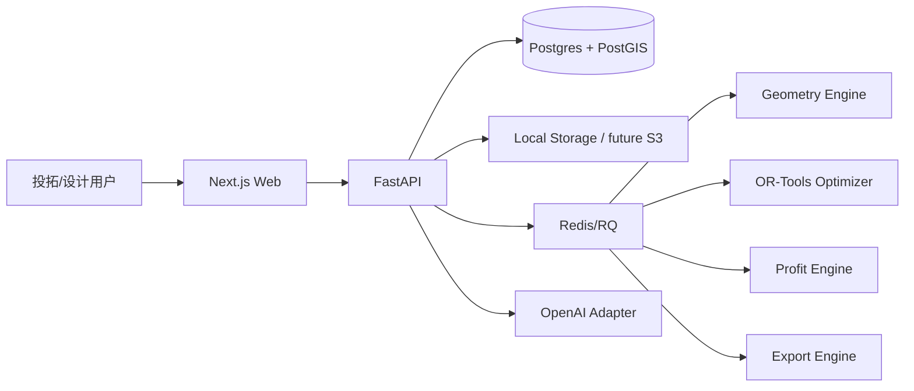

# LandWeaver Agent（地织）B 端 AI 强排与测算引擎：重新设计实现方案

> 版本：v1.0  
> 日期：2026-06-20  
> 目标环境：WSL2 Ubuntu 22.04 + Python 3.10+ + Node.js 20+  
> 仓库建议名：`LandWeaver-Agent`  
> 产品原则：**LLM 不直接画楼栋；LLM 只做自然语言入口和方案解释。最终几何、指标、收益和导出必须由本地可验证算法产生。**

---

## 1. 产品定义

### 1.1 名称与定位

**LandWeaver Agent（地织）** 是面向房地产开发商、投拓团队、设计管理团队和前期方案建筑师的 AI 强排与投拓测算引擎。

用户输入地块红线、规划条件、产品原型和经济假设后，系统生成多套楼栋排布方案，自动计算容积率、建筑密度、总建面、户数、货值、成本、毛利、约束违规和风险提示，并支持 GeoJSON、DXF、CSV 导出。

### 1.2 与 LandScout 的关系

```text
LandScout Agent（地脉）：发现哪里值得看
LandWeaver Agent（地织）：把一块地织成可比较、可测算、可导出的方案
```

### 1.3 一句话

> 一块地，多套强排，一眼看懂收益与风险。

---

## 2. 目标用户与业务场景

| 用户 | 场景 | 关注指标 | LandWeaver 输出 |
|---|---|---|---|
| 投拓人员 | 快速判断地块价值 | 容积率利用、货值、毛利 | 分钟级强排 + 测算表 |
| 设计管理 | 多方案比选 | 密度、间距、产品组合 | 方案对比 + 风险提示 |
| 方案建筑师 | 概念强排 | 楼栋轮廓、退界、导出 CAD | DXF/GeoJSON 底图 |
| 管理层 | 汇报决策 | 收益、风险、敏感性 | 简明解释 + 指标表 |

---

## 3. MVP 核心闭环

```text
创建项目
  -> 绘制/输入地块红线
  -> 输入规划约束和经济假设
  -> 创建楼栋产品原型
  -> 生成 site options
  -> 对比指标、风险和收益
  -> AI 解释方案
  -> 导出 GeoJSON / DXF / CSV
```

### 3.1 MVP 必做功能

| 模块 | 功能 | 技术实现 |
|---|---|---|
| 地块输入 | 手绘 polygon、示例矩形、GeoJSON 预留 | SVG/Canvas + Shapely |
| 约束输入 | FAR、密度、绿地率、退界、限高、间距、售价成本 | 表单 + Pydantic |
| 产品原型 | tower/slab 原型 | CRUD |
| 可建范围 | 按退界生成 buildable envelope | Shapely buffer |
| 候选生成 | 网格离散候选楼栋 | Shapely |
| 强排优化 | 选择不冲突楼栋组合 | OR-Tools CP-SAT |
| 指标测算 | GFA、户数、货值、成本、毛利 | Profit Engine |
| 方案解释 | 基于真实 metrics 生成解释 | OpenAI Structured/Responses |
| 导出 | GeoJSON/DXF/CSV | ezdxf + pandas |

### 3.2 MVP 暂不做

| 暂不做 | 原因 | 替代方案 |
|---|---|---|
| 精确日照审查 | 地方规范复杂 | 只做间距/高度近似风险 |
| 法定报批审查 | 需要规范库和资质 | 输出“用户输入约束下的结果” |
| 施工图级户型 | 深度不足 | 标准层概念框架二期 |
| DWG 原生编辑 | DWG 生态封闭 | 先 DXF |
| 企业成本库接入 | 数据敏感 | 用户输入经济假设 |

---

## 4. 技术路线

### 4.1 为什么不能用文生图做 B 端强排

To-B 强排要求：

- 面积可复算；
- 红线和退界可校验；
- 楼栋不冲突；
- 容积率、密度、限高可约束；
- 方案可导出到 CAD/GIS；
- 每个数字可追溯。

因此，LandWeaver 的核心不是图像生成，而是：

```text
参数化几何 + 约束优化 + 收益测算 + 可解释导出
```

### 4.2 技术栈

| 层 | 技术 | 说明 |
|---|---|---|
| Web | Next.js App Router + TypeScript + Tailwind + Zustand | 企业后台风格 |
| 地块画布 | SVG/Canvas | 米制本地坐标，MVP 不依赖地图 |
| API | FastAPI + Pydantic v2 | 强 schema |
| 数据库 | PostgreSQL + PostGIS | 空间数据持久化 |
| 队列 | Redis + RQ | 方案生成异步化 |
| 几何 | Shapely | polygon、buffer、intersection、distance |
| 优化 | OR-Tools CP-SAT | 离散候选选择 |
| 导出 | ezdxf + pandas/openpyxl | DXF/CSV/Excel |
| AI | OpenAI Responses + Structured Outputs | 需求抽取、方案解释 |

OR-Tools CP-SAT 适合把离散候选楼栋选择建模成整数/布尔约束优化；Shapely 适合在 Python 中操作和分析平面几何对象。

---

## 5. 系统架构



### 5.1 OpenAI 使用边界

所有 OpenAI 调用集中在：

```text
apps/api/app/services/openai_service.py
```

函数建议：

```python
def parse_planning_brief(user_text: str) -> PlanningBrief: ...
def explain_site_option(option_metrics: dict, violations: list, risk_flags: list) -> str: ...
```

环境变量：

```env
OPENAI_API_KEY=
OPENAI_MODEL_TEXT=gpt-5.5
OPENAI_MODEL_FAST=gpt-5.4-mini
```

方案解释必须基于真实 metrics，不得编造法规条文。没有上传规范文件或结构化法规数据时，只能说“基于用户输入约束”。

---

## 6. 数据模型

### 6.1 坐标约定

- 单位：米；
- 坐标：本地平面坐标；
- 红线 polygon 必须闭合；
- `north_angle_deg` 用于后续朝向/日照；
- 所有面积由后端计算，不信任前端输入；
- 导出 DXF 与 GeoJSON 均使用同一坐标。

### 6.2 核心实体

| 实体 | 字段 |
|---|---|
| Project | id, title, city, created_at, status |
| Parcel | id, project_id, unit, boundary, north_angle_deg, area_m2, source |
| PlanningBrief | target_customer, product_positioning, unit_mix_targets, risk_preference, strategy_preference, notes |
| ConstraintSet | far_max, building_density_max, green_ratio_min, height_limit_m, setbacks_m, min_spacing_m, parking_ratio_per_unit, saleable_ratio, assumptions |
| EconomicAssumptions | avg_selling_price_cny_per_m2, hard_cost_cny_per_m2, land_cost_cny, soft_cost_ratio, tax_ratio, marketing_ratio |
| BuildingPrototype | type, footprint_width_m, footprint_depth_m, floors_min, floors_max, typical_floor_gfa_m2, units_per_floor, avg_unit_area_m2, height_per_floor_m |
| CandidateFootprint | id, prototype_id, polygon, rotation_deg, floors, gfa_m2, footprint_area_m2 |
| BuildingInstance | prototype_id, footprint, centroid, rotation_deg, floors, height_m, gfa_m2, units, violations |
| SiteOption | id, strategy, buildings, metrics, violations, risk_flags, score, seed |
| ProfitSnapshot | total_gfa_m2, saleable_area_m2, units, parking_spaces, revenue_cny, hard_cost_cny, total_cost_cny, gross_margin_cny, gross_margin_ratio |

### 6.3 ConstraintSet 示例

```json
{
  "far_max": 2.5,
  "building_density_max": 0.28,
  "green_ratio_min": 0.30,
  "height_limit_m": 80,
  "setbacks_m": {"north": 10, "south": 10, "east": 8, "west": 8},
  "min_spacing_m": 18,
  "parking_ratio_per_unit": 1.1,
  "saleable_ratio": 0.82,
  "assumptions": {
    "avg_selling_price_cny_per_m2": 32000,
    "hard_cost_cny_per_m2": 5200,
    "land_cost_cny": 600000000,
    "soft_cost_ratio": 0.12,
    "tax_ratio": 0.09,
    "marketing_ratio": 0.03
  }
}
```

---

## 7. 核心算法设计

### 7.1 Geometry Engine

必须实现：

```python
def normalize_polygon(points): ...
def compute_area_m2(polygon): ...
def buildable_envelope(parcel, setbacks_m): ...
def candidate_footprints(envelope, prototype, spacing_grid_m, rotations): ...
def is_valid_placement(footprint, envelope): ...
def compute_conflicts(candidates, min_spacing_m): ...
def density_area(footprints): ...
```

MVP 的可建范围可用最保守 inward buffer：

```text
buildable_envelope = parcel_polygon.buffer(-max_setback)
```

二期再按四向退界、道路红线、异形地块做更细规则。

### 7.2 Optimizer：CP-SAT 离散候选选择

建模：

- 每个 candidate building 一个 BoolVar；
- 冲突候选不能同时选；
- 总 GFA <= 地块面积 × FAR；
- 总基底面积 <= 地块面积 × 建筑密度；
- 楼高 <= 限高；
- 目标函数随 strategy 变化。

策略：

| 策略 | 目标函数 |
|---|---|
| `revenue_first` | 最大化货值/GFA |
| `balanced` | FAR 利用率 + 毛利 - 风险惩罚 |
| `low_risk` | 最大化合规余量，降低密度/间距风险 |

### 7.3 Profit Engine

公式：

```text
saleable_area = total_gfa * saleable_ratio
units = sum(units_per_floor * floors)
parking_spaces = ceil(units * parking_ratio_per_unit)
revenue = saleable_area * avg_selling_price_cny_per_m2
hard_cost = total_gfa * hard_cost_cny_per_m2
total_cost = land_cost + hard_cost * (1 + soft_cost_ratio + tax_ratio + marketing_ratio)
gross_margin = revenue - total_cost
gross_margin_ratio = gross_margin / revenue
```

敏感性分析：

- 售价：-10%、-5%、base、+5%、+10%；
- 建安成本：-5%、base、+5%；
- 输出 gross_margin_ratio 变化。

### 7.4 Export Engine

| 格式 | 内容 |
|---|---|
| GeoJSON | parcel、buildable_envelope、building footprints、properties |
| DXF | `PARCEL_REDLINE`、`BUILDABLE_ENVELOPE`、`BUILDING_FOOTPRINT`、`BUILDING_LABEL`、`RISK` 图层 |
| CSV | 方案汇总 + 楼栋明细 |

---

## 8. API 设计

| Method | Path | 说明 |
|---|---|---|
| POST | `/api/projects` | 创建项目 |
| GET | `/api/projects/{project_id}` | 项目聚合视图 |
| POST | `/api/projects/{project_id}/parcels` | 保存地块 polygon |
| POST | `/api/projects/{project_id}/brief` | 自然语言约束抽取 |
| POST | `/api/projects/{project_id}/constraints` | 保存规划/经济约束 |
| POST | `/api/projects/{project_id}/prototypes` | 创建楼栋原型 |
| POST | `/api/projects/{project_id}/generate-site-options` | 启动方案生成任务 |
| GET | `/api/jobs/{job_id}` | 查询任务状态 |
| GET | `/api/projects/{project_id}/options` | 方案列表 |
| GET | `/api/options/{option_id}` | 方案详情 |
| POST | `/api/options/{option_id}/explain` | AI 解释方案 |
| POST | `/api/options/{option_id}/export?format=geojson|dxf|csv` | 导出 |

---

## 9. 前端信息架构

```text
/
/projects/[id]/parcel
/projects/[id]/constraints
/projects/[id]/prototypes
/projects/[id]/generate
/projects/[id]/options
/projects/[id]/options/[optionId]
```

| 页面 | 组件 |
|---|---|
| 首页 | 产品说明、创建项目 |
| 地块页 | SVG/Canvas polygon 编辑、示例地块 |
| 约束页 | FAR、密度、绿化、限高、退界、售价成本 |
| 原型页 | tower/slab prototype CRUD |
| 生成页 | 任务启动、进度、错误/无解提示 |
| 方案页 | 平面 SVG、指标表、风险标签 |
| 详情页 | 方案解释、收益敏感性、导出按钮 |

---

## 10. 质量与测试

### 10.1 pytest 必测

| 测试 | 目标 |
|---|---|
| polygon normalize/area | 自交/未闭合处理 |
| buildable envelope | 退界后面积变小且 valid |
| candidate generation | 候选在 envelope 内 |
| conflict detection | 距离不足能识别 |
| CP-SAT happy path | 能返回 feasible solution |
| infeasible case | 返回无解原因和放宽建议 |
| profit calculation | 公式正确 |
| export files | GeoJSON/DXF/CSV 文件存在且含预期内容 |
| API happy path | 项目 -> 地块 -> 约束 -> 原型 -> 生成 -> 导出 |

### 10.2 产品指标

| 指标 | MVP 目标 |
|---|---|
| 示例地块生成 3 套方案 | < 60 秒 |
| 硬约束违规 | 0 或明确列出 |
| FAR 利用率 | 可配置；balanced 默认追求 90%+ |
| 导出可打开 | DXF 可在 CAD 软件中打开 |
| AI 解释 groundedness | 100% 基于 metrics |

---

## 11. 12 周开发计划

| 周 | 目标 | 交付 |
|---|---|---|
| 1 | Monorepo + infra | FastAPI/Next.js/PostGIS/Redis |
| 2 | 地块输入 | SVG polygon + Shapely 校验 |
| 3 | 约束与经济假设 | 表单 + schema |
| 4 | 产品原型 | tower/slab CRUD |
| 5 | Geometry Engine | envelope/candidates/conflicts |
| 6 | OR-Tools Optimizer | 3 策略方案生成 |
| 7 | Profit Engine | 收益与敏感性 |
| 8 | 方案对比 UI | SVG + 指标表 |
| 9 | OpenAI Brief/Explain | structured brief + grounded explanation |
| 10 | Export Engine | GeoJSON/DXF/CSV |
| 11 | 无解处理 | infeasible reason + relax suggestions |
| 12 | 测试和文档 | pytest、README、演示数据 |

---

## 12. 风险与规避

| 风险 | 规避 |
|---|---|
| 用户把结果当法规审查 | 明确“仅基于用户输入约束” |
| CP-SAT 无解或太慢 | 候选预过滤、grid 粒度调节、无解建议 |
| 方案不够像真实强排 | 允许锁定/二期拖拽；先导出给设计师修改 |
| 指标争议 | 展示公式、输入快照、solver seed |
| LLM 编造规范 | 禁止引用未上传法规，解释只基于 metrics |
| 企业数据敏感 | 本地部署优先、日志脱敏、权限二期 |

---

## 13. Codex Prompt（可复制）

```text
你是资深 AEC/PropTech 全栈工程师 + 运筹优化工程师。请在当前空仓库中实现 `LandWeaver-Agent`（地织智能体）MVP，目标运行环境为 WSL2 Ubuntu 22.04。请直接创建可运行代码、测试、fixtures、README，不要只写说明。

# 0. 产品目标
LandWeaver Agent（地织）是面向房地产开发商、投拓团队和方案设计团队的 B 端 AI 强排与测算引擎。用户输入地块红线、规划指标、产品原型和经济假设后，系统用本地确定性几何与优化算法生成多组楼栋排布方案，计算容积率、建筑密度、建面、户数、货值、成本、毛利，并导出 GeoJSON/DXF/CSV。OpenAI 只用于自然语言 PlanningBrief 抽取和基于真实指标的方案解释，不得直接生成最终楼栋几何。

# 1. 强制技术栈
- Monorepo：`LandWeaver-Agent/`
- 后端：FastAPI + Pydantic v2 + SQLAlchemy 2 + Alembic + PostgreSQL/PostGIS + Redis/RQ + Shapely + OR-Tools CP-SAT + ezdxf + pandas/openpyxl + OpenAI Python SDK + pytest。
- 前端：Next.js App Router + TypeScript + Tailwind + Zustand + zod + SVG/Canvas。MVP 不依赖在线地图；使用本地米制坐标画布。
- 基础设施：`infra/docker-compose.yml` 启动 `postgis/postgis:16-3.4` 和 `redis:7`。
- Python 3.10+，Node.js 20+。

# 2. 仓库结构
请创建：
LandWeaver-Agent/
  apps/api/
    app/main.py
    app/core/config.py
    app/db/
    app/models/
    app/schemas/
    app/routes/
    app/services/openai_service.py
    app/workers/jobs.py
    tests/
  apps/web/
    app/
    components/
    lib/api.ts
    lib/types.ts
    store/
  engines/
    geometry/
      parcel.py
      envelope.py
      collision.py
      candidates.py
    optimizer/
      site_optimizer.py
      diversity.py
    profit/
      calculator.py
      sensitivity.py
    export/
      geojson_exporter.py
      dxf_exporter.py
      csv_exporter.py
  packages/schemas/
    parcel.schema.json
    planning_brief.schema.json
    site_option.schema.json
  tests/fixtures/
    rectangular_parcel.json
    planning_constraints.json
    tower_prototype.json
    slab_prototype.json
  infra/docker-compose.yml
  .env.example
  README.md

# 3. 核心数据模型
实现 Pydantic schema，并在 API、fixtures、测试中复用：
- Project：id, title, city, created_at, status。
- Parcel：id, project_id, unit=m, boundary, north_angle_deg, area_m2, source。
- PlanningBrief：target_customer, product_positioning, unit_mix_targets, risk_preference, strategy_preference, notes。
- ConstraintSet：far_max, building_density_max, green_ratio_min, height_limit_m, setbacks_m, min_spacing_m, parking_ratio_per_unit, saleable_ratio, assumptions。
- EconomicAssumptions：avg_selling_price_cny_per_m2, hard_cost_cny_per_m2, land_cost_cny, soft_cost_ratio, tax_ratio, marketing_ratio。
- BuildingPrototype：type=tower|slab|villa|podium, footprint_width_m, footprint_depth_m, floors_min, floors_max, typical_floor_gfa_m2, units_per_floor, avg_unit_area_m2, height_per_floor_m。
- BuildingInstance：prototype_id, footprint, centroid, rotation_deg, floors, height_m, gfa_m2, units, violations。
- SiteOption：id, strategy=revenue_first|balanced|low_risk, parcel_id, buildings, metrics, violations, risk_flags, score, seed。
- ProfitSnapshot：total_gfa_m2, saleable_area_m2, units, parking_spaces, revenue_cny, hard_cost_cny, total_cost_cny, gross_margin_cny, gross_margin_ratio。

# 4. 后端 API
必须实现并能通过 pytest happy path：
1. `POST /api/projects`：创建项目。
2. `POST /api/projects/{project_id}/parcels`：保存地块 polygon，支持直接传 points；自动计算面积；修复 polygon；source=manual|geojson|dxf_placeholder。
3. `POST /api/projects/{project_id}/brief`：自然语言 -> PlanningBrief，使用 OpenAI Structured Outputs；无 OPENAI_API_KEY 时 deterministic mock。
4. `POST /api/projects/{project_id}/constraints`：保存规划与经济约束。
5. `POST /api/projects/{project_id}/prototypes`：创建楼栋原型。
6. `POST /api/projects/{project_id}/generate-site-options`：启动 RQ job，返回 job_id。
7. `GET /api/jobs/{job_id}`：返回 status、stage、progress、result_ids、error。
8. `GET /api/projects/{project_id}/options`：获取方案列表。
9. `GET /api/options/{option_id}`：方案详情。
10. `POST /api/options/{option_id}/explain`：OpenAI 只能基于 metrics/violations/risk_flags 解释；无 key 返回 mock。
11. `POST /api/options/{option_id}/export?format=geojson|dxf|csv`：导出文件，返回下载路径。
12. `GET /api/projects/{project_id}`：聚合返回地块、约束、原型、方案。

# 5. Geometry Engine 要求
必须实现并单测：
- `normalize_polygon(points)`：修复闭合、方向、自交；无效时返回明确错误。
- `compute_area_m2(polygon)`。
- `buildable_envelope(parcel, setbacks_m)`：MVP 可使用 inward buffer 取最保守退界。
- `candidate_footprints(envelope, prototype, spacing_grid_m, rotations)`：生成离散候选楼栋 footprint。
- `is_valid_placement(footprint, envelope)`。
- `compute_conflicts(candidates, min_spacing_m)`：计算候选之间冲突矩阵。
- `density_area(footprints)`。

# 6. Optimizer 要求
必须用 OR-Tools CP-SAT：
- 每个候选楼栋一个 BoolVar。
- 冲突候选不能同时选择。
- 总 GFA <= parcel_area * far_max。
- 总 footprint_area <= parcel_area * building_density_max。
- 楼栋高度 <= height_limit_m。
- 目标函数按 strategy 区分：
  - revenue_first：最大化 revenue/gfa。
  - balanced：最大化 FAR 利用率 + 毛利 - 风险惩罚。
  - low_risk：最大化合规余量 + 减少间距/密度风险。
- 至少生成 3 个方案；通过不同 strategy、seed、候选排序或约束权重实现差异。
- 无解时返回 infeasible_reason 和 relax_suggestions，例如降低目标 FAR、减少最小间距、调整楼栋原型尺寸。

# 7. Profit Engine 要求
必须实现并单测：
- saleable_area = total_gfa * saleable_ratio。
- units = sum(building.units_per_floor * floors)。
- parking_spaces = ceil(units * parking_ratio_per_unit)。
- revenue = saleable_area * avg_selling_price_cny_per_m2。
- hard_cost = total_gfa * hard_cost_cny_per_m2。
- total_cost = land_cost + hard_cost * (1 + soft_cost_ratio + tax_ratio + marketing_ratio)。
- gross_margin = revenue - total_cost。
- gross_margin_ratio = gross_margin / revenue。
- sensitivity：售价 ±5%、±10%；建安成本 ±5%。

# 8. Export Engine 要求
必须实现并单测：
- GeoJSON：parcel, buildable_envelope, building_footprints，properties 包含 floors/gfa/units/score。
- DXF：用 ezdxf 输出图层：PARCEL_REDLINE、BUILDABLE_ENVELOPE、BUILDING_FOOTPRINT、BUILDING_LABEL、RISK。
- CSV：方案指标 summary + building rows。

# 9. OpenAI 使用边界
所有 OpenAI 调用只能在 `apps/api/app/services/openai_service.py` 中出现。模型名从环境变量读取：
- `OPENAI_MODEL_TEXT` 默认 `gpt-5.5`。
- `OPENAI_MODEL_FAST` 默认 `gpt-5.4-mini`。
实现：
- `parse_planning_brief(user_text) -> PlanningBrief`：严格 JSON Schema。
- `explain_site_option(option_metrics, violations, risk_flags) -> str`：不得编造法规；必须显式说明“仅基于用户输入约束和系统计算指标”。
无 key 时 deterministic mock。

# 10. 前端页面
使用 Next.js App Router，实现：
1. `/`：产品首页 + 创建项目按钮，品牌名显示 `LandWeaver Agent（地织）`。
2. `/projects/[id]/parcel`：SVG/Canvas 绘制地块；提供“插入 120m × 80m 示例地块”按钮；保存到后端。
3. `/projects/[id]/constraints`：输入 FAR、密度、绿地率、退界、限高、楼间距、售价、建安、地价。
4. `/projects/[id]/prototypes`：创建 tower/slab 原型。
5. `/projects/[id]/generate`：启动生成任务，轮询 job。
6. `/projects/[id]/options`：SVG 展示 parcel、buildable envelope、buildings；表格对比 FAR、密度、建面、户数、货值、成本、毛利、score、violations、risk_flags。
7. `/projects/[id]/options/[optionId]`：方案详情、AI 解释、导出 GeoJSON/DXF/CSV。

# 11. 测试
必须提供 pytest：
- polygon normalize/area。
- buildable envelope。
- candidate footprint generation。
- conflict detection。
- CP-SAT happy path returns feasible solution。
- infeasible case returns reason。
- profit calculation。
- geojson/dxf/csv export files exist and contain expected layers/columns。
- API happy path：project -> parcel -> constraints -> prototype -> generate mock -> options -> export。

# 12. README 与启动命令
README 必须包含：
- 产品定位。
- WSL2 Ubuntu 22.04 启动步骤。
- `.env.example` 说明。
- 后端命令：venv、pip install、alembic upgrade、uvicorn。
- 前端命令：npm install、npm run dev。
- 测试命令：pytest。
- “已实现功能”。
- “限制与后续替换点”。
- “OpenAI API 使用位置”。
- “强排算法说明”。

# 13. 代码质量
- 不要提交真实 API Key。
- 坐标单位统一为米。
- 不要让 LLM 直接生成最终楼栋坐标。
- 所有指标必须由本地公式计算。
- 错误响应要清晰。
- 先实现能跑通的最小闭环，再补测试并修复失败。
```

---

## 14. 参考资料

- OpenAI Structured Outputs: https://developers.openai.com/api/docs/guides/structured-outputs
- OpenAI Models: https://developers.openai.com/api/docs/models
- OpenAI Codex CLI: https://developers.openai.com/codex/cli
- Shapely: https://shapely.readthedocs.io/
- OR-Tools CP-SAT: https://developers.google.com/optimization/cp/cp_solver
- OR-Tools Python: https://developers.google.com/optimization/introduction/python
- Graph2Plan: https://arxiv.org/abs/2004.13204
- ResPlan: https://arxiv.org/abs/2508.14006
